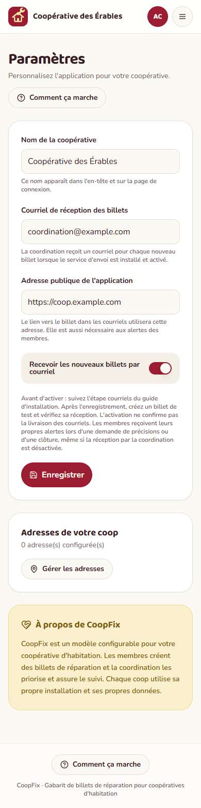

# Votre coop, étape par étape

**Une fois le site installé, configurez votre coop en suivant ces étapes.**

Ce guide explique l'utilisation après l'installation. La mise en ligne est décrite séparément dans **GUIDE-INSTALLATION.md**.
Chaque coop a son propre lien et ses propres données.

## 1. Ouvrir votre application
Ouvrez le lien du site de votre coop. Cela fonctionne sur ordinateur et téléphone, sans installation.

## 2. Inscrire le nom et le courriel
Administrateur : connectez-vous et ouvrez **Paramètres**.
- Inscrivez le nom de votre coop.
- Inscrivez le courriel qui doit recevoir les nouveaux billets.
- Cliquez sur **Enregistrer**.

L'adresse publique du site est renseignée par la personne responsable de l'installation lors de l'installation. Les notifications par courriel doivent avoir été activées et testées par la personne responsable de l'installation.

*Capture d'exemple : le nom et le courriel affichés sont fictifs.*

## 3. Ajouter les immeubles
Ouvrez **Adresses**, puis **Ajouter une adresse**. Inscrivez l'adresse de chaque immeuble. Le nombre de logements est facultatif. Enregistrez.

## 4. Partager le lien
Envoyez le lien du site de votre coop aux membres. Chaque membre clique sur **Devenir membre** et s'inscrit lui-même. Il indique son adresse et son logement. Il confirme son courriel si demandé.

Après l’inscription, seul un administrateur peut changer l’adresse ou le logement dans **Membres → Modifier**. En cas de déménagement ou d’adresse manquante, contactez la coordination.

## 5. Envoyer un billet
Le membre clique sur **Nouveau billet**, décrit le problème, choisit **Normal, Prioritaire ou Urgent**, puis envoie sa demande. Il retrouve ses demandes dans **Mes billets**.

## 6. Répondre et compléter
Administrateur : ouvrez le billet.
- Pour poser une question : cochez **Demander des précisions au membre**, écrivez votre question et cliquez sur **Publier**.
- Quand la réparation est faite : cliquez sur **Complété**.

Le membre reçoit une alerte par courriel pour ces deux événements lorsque le service est actif. Il répond dans les commentaires du billet.

## Avant de démarrer pour vrai
Créez un billet d'essai. Vérifiez le courriel reçu par la coordination, puis les deux alertes au membre.

En cas de problème de connexion ou de courriel, contactez la personne responsable désignée par votre coop. Vous n'avez pas à modifier le code ou la base de données.

## 7. Activer les courriels de votre coop

L’adresse d’envoi est celle qui apparaît sur les activations et les alertes. Le courriel de réception des nouveaux billets se choisit séparément dans **Paramètres**.

1. Choisissez une adresse d’envoi et désignez la personne responsable du service de courriel.
2. Faites connecter le service, selon la section **Connecter les courriels** du guide d’installation. Une adresse seule ne suffit pas.
3. Faites tester la réception avant d’activer la confirmation obligatoire.
4. Testez une nouvelle inscription, une demande de précisions et un billet complété.

## 8. Confirmer son inscription

Une fois le service activé, créez votre compte, consultez votre boîte courriel et cliquez sur le lien d’activation. Vérifiez les indésirables si nécessaire. Cette étape concerne les membres et le premier administrateur. Le premier compte créé est administrateur; les suivants sont membres. Les comptes déjà créés restent accessibles et ne reçoivent pas automatiquement une nouvelle activation.

## Mot de passe oublié
Sur la page de connexion, cliquez sur **Mot de passe oublié ?**. Inscrivez le courriel de votre compte, ouvrez le lien reçu, puis saisissez deux fois votre nouveau mot de passe. Si le lien a expiré, demandez-en un nouveau.
